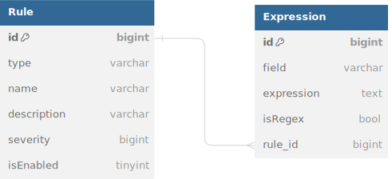

# Host-based Intrusion Detection System

[TOC]

## 介绍

### IDS

IDS (Instrucion Detection System) 即入侵检测系统，是一种主动防御的安全技术，主要用于检测网络和系统中的异常行为，如端口扫描、暴力破解、漏洞利用等，以及恶意软件的传播和潜伏。IDS 通过对日志、文件、进程等进行监控，发现异常行为后，会记入安全管理系统(如 SIEM) 或者发送警报，以便安全人员进行进一步的分析和处理[^1]。

#### IDS的组成

IDS 由以下几个部分组成[^2]：

- **传感器**：负责监控网络、主机、应用等，发现异常行为后，将信息发送给 IDS 引擎。
- **分析器**：负责对传感器发送的信息进行分析，判断是否为异常行为。
- **用户接口**：负责向用户展示 IDS 的运行状态、异常行为等信息。

#### IDS的分类

IDS 可以主要分为以下两类[^2]：

- **基于网络的 IDS (NIDS)**：基于网络的 IDS 主要用于监控网络流量，发现网络中的异常行为。NIDS 通常部署在网络的边界，如防火墙、路由器等，以便监控网络中的所有流量。
- **基于主机的 IDS (HIDS)**：基于主机的 IDS 主要用于监控主机的日志、文件、进程等，发现主机中的异常行为。HIDS 通常部署在主机上，以便监控主机的所有行为。

本文主要介绍基于主机的 IDS。

### HIDS

HIDS (Host-based Intrusion Detection System) 即基于主机的入侵检测系统，是一种主动防御的安全技术，主要用于检测主机中的异常行为，如端口扫描、暴力破解、漏洞利用等，以及恶意软件的传播和潜伏。HIDS 通过对日志、文件、进程等进行监控，发现异常行为后，会记入安全管理系统 (如 SIEM) 或者发送警报，以便安全人员进行进一步的分析和处理[^3]。

## HIDS 的数据源

### 系统调用

在 Unix/Linux 系统中，进程在系统中的一系列系统调用被公认为是HIDS的首选数据源[^4][^5]。

传统来说，Windows 下由于 DLL 的广泛使用，导致谁调用了特定的系统调用变得不那么明确。但是 G. Creech 在2014年的研究[^4]中，提出了一种基于 Windows 的 HIDS，通过基于虚拟内核理论 (The Virtual Kernel Concept)，监控 DLL 函数调用踪迹，实现了类似于 Unix/Linux 下的 System Call Trace。

### 审计记录

大多数现代操作系统以及很多应用程序都会记录一些重要的事件，如用户登录、文件访问、进程创建等。这些记录可以作为 HIDS 的数据源。

### 文件完整性校验

文件完整性校验是一种被动的防御技术，主要用于检测文件是否被篡改。HIDS 可以通过文件完整性校验来检测文件是否被篡改，从而发现异常行为。

本方法的缺点是，需要用已有的正常文件生成一个文件完整性校验数据库，并且定期监控维护，这个过程需要花费大量的时间和资源。

[Tripwire](https://github.com/Tripwire/tripwire-open-source) 就是一个基于文件完整性校验的 HIDS。Tripwire 会根据策略文件配置，监视文件的哈希值、权限、所有权等，从而发现文件是否被篡改[^6]。

### 注册表监控

Windows 系统中的注册表是一个重要的配置数据库，记录了系统的配置信息。HIDS 可以通过监控注册表的变化，发现异常行为。

本方法的缺点是，注册表仅局限于 Windows，且变化非常频繁、数量庞大，监控可能会带来较大的性能开销。恶意软件对注册表的修改也较少，因此注册表监控的效果可能不是很好。

## IDS 的分析原理

判断一个检测方法能力高低的最主要的指标是误报 (False Positive, FP) 率和漏报 (False Negative, FN) 率，而衡量整个系统好坏还需要考虑到系统的效率。

在 IDS 系统中，常见的检测方法有异常检测 (Anomaly Detection) 和特征或启发式检测 (Signature or Heuristic Detection)。前者定义了正常行为的模型，来判断是否为异常行为；后者则直接检测行为是否为恶意行为。

### 异常检测

异常检测首先会有一个训练阶段，用于生成一个正常行为的模型。在训练阶段，IDS 会监控系统的行为，生成一个正常行为的模型。训练过程可以在不同的时间段进行，也可以持续训练使其演化。

如前文提到的，HIDS 中通常利用系统调用来作为数据源。在 Linux 内核源码[^8] 的`arch/x86/entry/syscalls/syscall_64.tbl`文件中，列出了`x86_64`架构下的系统调用 (如 Code 1 所示)。HIDS 可以通过监控系统调用的调用次数、调用顺序、调用参数等，来生成一个正常行为的模型。当系统调用的行为与模型不符时，IDS 就会判断为异常行为。

```
#
# 64-bit system call numbers and entry vectors
#
# The format is:
# <number> <abi> <name> <entry point>
...
0    common    read            sys_read
1    common    write            sys_write
2    common    open            sys_open
...
546    x32    preadv2            compat_sys_preadv64v2
547    x32    pwritev2        compat_sys_pwritev64v2
# This is the end of the legacy x32 range.  Numbers 548 and above are
# not special and are not to be used for x32-specific syscalls.
```

*Code 1 - arch/x86/entry/syscalls/syscall_64.tbl文件片段[^8]*

Windows 下 HIDS 通常监控 DLL 函数调用踪迹，来生成一个正常行为的模型。当 DLL 函数调用的行为与模型不符时，IDS 就会判断为异常行为。表 1 列出了 Windows 下 HIDS 关注的部分重点 DLL 文件。

| DLL | 说明 |
| --- | --- |
| kernel32.dll | Windows API 的核心组件，包含了系统的内存管理、进程管理、线程管理、同步、设备管理、文件管理、网络管理等功能。 |
| user32.dll | Windows API 的用户界面组件，包含了窗口管理、菜单管理、消息管理、剪贴板管理、对话框管理、图标管理、光标管理、键盘管理、鼠标管理等功能。 |
| comctl32.dll | Windows API 的通用控件组件，包含了通用控件、通用对话框、通用对话框控件等功能。 |
| msvcrt.dll | Microsoft Visual C++ 运行库，包含了 C/C++ 的运行库。 |
| msvcpp.dll | Microsoft Visual C++ 运行库，包含了 C++ 的运行库。 |
| ntdll.dll | Windows API 的内部组件，包含了系统的内存管理、进程管理、线程管理、同步、设备管理、文件管理、网络管理等功能。 |

*表 1 - Windows 下 HIDS 关注的部分重点 DLL 文件[^2]*

在 Garcı́a-Teodoro 等人的研究[^7]中，列出了 IDS 一些常用的异常检测方法：


*图 1 - 异常检测技术分类[^7]*

#### 基于统计

基于统计 (Statistical based) 法利用传感器的数据，通过统计学方法，生成一个正常行为的指标曲线。最开始的统计法使用单变量 (Univariate) 模型，每一个指标都有一个单独的模型。由于单变量模型较为粗糙，后更多使用多变量 (Multivariate) 模型，将多个指标组合成一个模型，可以更好地反映系统的整体行为。时间序列模型 (Time Series Model) 是一种特殊的多变量模型，它将时间作为一个指标，可以更好地区分行为。

统计法的优点是计算简单、开销低，但是由于其模型较为简单，可能会导致误报率和漏报率难以平衡。

#### 基于规则

基于知识 (Knowledge based) 法利用规则集对传感器的数据进行分析，判断是否为异常行为。规则集通常在训练阶段中手动生成和特征化。这些规则的描述通常利用有限状态机 (Finite State Machine, FSM) 或标准描述语言 (Description Languages) 进行描述。

基于规则法的优点是可以根据需要生成规则，检测效果较为精准和灵活，但是需要大量的人工参与，且规则集的维护和更新也是一个问题。

#### 基于机器学习

基于机器学习 (Machine Learning based) 法利用机器学习的方法，对传感器的数据进行建模。随后，利用训练好的模型，对传感器的数据进行分析，判断是否为异常行为。

基于机器学习的缺陷是需要大量的训练数据，训练时的开销较大，且模型的可解释性较差。当然，当模型建立完成后，可以实现自动化的检测，且检测效果较好、开销较小。

### 特征检测和启发式检测

特征检测 (Signature based) 和启发式检测 (Heuristic based) 是两种常用的检测方法。目前市面上大多数的反病毒软件都是基于特征检测结合启发式检测，对恶意软件进行检测的。

#### 特征检测

特征检测利用对已知的恶意行为进行分析提取出的一个特征集，对传感器的数据进行分析，判断是否为恶意行为。

特征检测的优点是精准和快速，特征集的高复用性也保证了特征检测法的广泛可用性。但是特征检测法的缺点也很明显，由于学习能力的缺失，其需要大量的数据生成精准的特征集。此外，特征检测点到点的检测方法使其无法检测没有任何特征的新漏洞。

#### 启发式检测

启发式检测是基于规则的检测方法，利用已知的恶意行为，制定一系列的规则来检测和识别可能的入侵行为。这些规则可以是基于已知的攻击行为，也可以是基于安全策略和模式识别等方面的规则。

启发式检测的优点是可以检测到一部分的新漏洞，但是不当的规则可能导致误报率较高，如果新漏洞利用不常见的攻击路径也无法被检测到。

## 简单 HIDS 的实现

本节简单介绍一下 Linux 下 HIDS 的实现。本例子主要基于 c 配合 golang 实现 (使用 [cgo](https://golang.org/cmd/cgo/) 在 golang 中直接调用 c 函数，利用 `udp socket` 通信)。项目部分思路参考于[^9][^10]。

### 进程监控

#### Netlink

利用 `netlink` 机制，可以让程序在内核态和用户态之间传递消息。利用这一特性，可以在内核态中监控程序的行为，从而实现 HIDS。

如 Code 2 所示，`netlink` 机制的使用非常简单，只需要直接创建一个 `netlink` socket，然后通过 `bind` 绑定即可监听。

```c
/**
 * connect to netlink
 * @return netlink socket fd
 */
static int nl_connect() {
    int netlinkSock;
    struct sockaddr_nl netlinkSockAddr;

    netlinkSock = socket(PF_NETLINK, SOCK_DGRAM, NETLINK_CONNECTOR);
    if (netlinkSock == -1) {
        perror("socket");
        return -1;
    }

    netlinkSockAddr.nl_family = AF_NETLINK;
    netlinkSockAddr.nl_groups = CN_IDX_PROC;
    netlinkSockAddr.nl_pid = getpid();

    if (bind(netlinkSock, (struct sockaddr *)&netlinkSockAddr, sizeof(netlinkSockAddr)) == -1) {
        perror("bind");
        close(netlinkSock);
        return -1;
    }

    return netlinkSock;
}
```

*Code 2 - netlink 机制的使用*

在内核态中，可以通过 `netlink` 机制，监听到进程的创建、退出、执行的系统调用等。如 Code 3 所示，`netlink` 机制的回调函数中，可以通过 `nlcn_msg.proc_ev.what` 来判断进程的行为，然后通过 `nlcn_msg.proc_ev.event_data` 来获取进程的信息。Code 3中，将进程的行为通过 `udp` socket 发送给服务器，服务器可以根据这些信息来判断是否为异常行为。

```c
/**
 * handle netlink message
 * @param netlinkSock netlink socket fd
 * @param rev_sock udp socket fd for send message to server
 * @param server server address
 * @return 0 on success, -1 on error
 */
static int handle_proc_ev(int netlinkSock, int rev_sock, struct sockaddr_in server) {
    struct __attribute__((aligned(NLMSG_ALIGNTO))) {
        struct nlmsghdr nl_hdr;
        struct __attribute__((__packed__)) {
            struct cn_msg cn_msg;
            struct proc_event proc_ev;
        };
    } nlcn_msg;

    char buf[256];
    char sendbuffer[256];
    char *out;
    int recvLen;

    cJSON *root = cJSON_CreateObject();
    cJSON *data = cJSON_CreateObject();

    while (1) {
        recvLen = recv(netlinkSock, &nlcn_msg, sizeof(nlcn_msg), 0);
        if (recvLen == 0) {
            return 0;
        } else if (recvLen == -1) {
            if (errno == EINTR) continue;
            perror("netlink recv");
            return -1;
        }

        root = cJSON_CreateObject();
        data = cJSON_CreateObject();
        switch (nlcn_msg.proc_ev.what) {
            case PROC_EVENT_NONE:
                cJSON_AddStringToObject(root, "type", "none");

                out = cJSON_Print(root);
                sprintf(sendbuffer, "%s\n", out);
                sendto(rev_sock, sendbuffer, strlen(sendbuffer), 0, (struct sockaddr *)&server, sizeof(server));
                break;
            case PROC_EVENT_FORK:
                cJSON_AddStringToObject(root, "type", "fork");
                cJSON_AddNumberToObject(data, "pid", nlcn_msg.proc_ev.event_data.fork.child_pid);
                cJSON_AddNumberToObject(data, "tgid", nlcn_msg.proc_ev.event_data.fork.child_tgid);
                cJSON_AddNumberToObject(data, "ppid", nlcn_msg.proc_ev.event_data.fork.parent_pid);
                cJSON_AddNumberToObject(data, "ptgid", nlcn_msg.proc_ev.event_data.fork.parent_tgid);
                cJSON_AddItemToObject(root, "data", data);

                out = cJSON_Print(root);
                sprintf(sendbuffer, "%s\n", out);
                sendto(rev_sock, sendbuffer, strlen(sendbuffer), 0, (struct sockaddr *)&server, sizeof(server));
                break;
            case PROC_EVENT_EXEC:
                cJSON_AddStringToObject(root, "type", "exec");
                cJSON_AddNumberToObject(data, "pid", nlcn_msg.proc_ev.event_data.exec.process_pid);
                cJSON_AddNumberToObject(data, "tgid", nlcn_msg.proc_ev.event_data.exec.process_tgid);
                cJSON_AddItemToObject(root, "data", data);

                out = cJSON_Print(root);
                sprintf(sendbuffer, "%s\n", out);
                sendto(rev_sock, sendbuffer, strlen(sendbuffer), 0, (struct sockaddr *)&server, sizeof(server));
                break;
            case PROC_EVENT_UID:
                break;
            case PROC_EVENT_GID:
                break;
            case PROC_EVENT_EXIT:
                break;
            default:
                break;
        }
    }

    return 0;
}
```

*Code 3 - netlink 机制的回调函数*

在 golang 中，可以通过 `cgo` 启动上述 c 的监听器，然后通过 `udp` socket 接收消息，如 Code 4 所示。

```go
package agent

/*
#cgo CFLAGS: -I../c-libs
#define GO_ENV
#include "cJSON/cJSON.c"
#include "monitor/linux/monitor.c"
*/
import "C"

import (
    "encoding/json"
    "fmt"
    "log"
    "net"
    "os"

    "hids/model"
)

// processMonitorStart
//
//    @param ip string
//    @param port int
func processMonitorStart(ip string, port int) {
    log.Println(fmt.Sprintf("Starting System Monitor Tunnel on %s:%d", ip, port))

    udpAddr, err := net.ResolveUDPAddr("udp", fmt.Sprintf("%s:%d", ip, port))
    if err != nil {
        log.Println("error ResolveUDPAddr")
        os.Exit(1)
    }

    serverConn, err := net.ListenUDP("udp", udpAddr)
    if err != nil {
        log.Println("ListenUDP error: ", err)
        return
    }
    defer serverConn.Close()

    go C.startMonitor(C.CString(ip), C.int(port))

    buf := make([]byte, 1024)
    var data model.UdpResponse
    for {
        n, _, err := serverConn.ReadFromUDP(buf)
        if err != nil {
            log.Println("error during read: ", err)
        }

        err = json.Unmarshal(buf[:n], &data)
        if err != nil {
            log.Println("json.Unmarshal error: ", err)
        }
        log.Println("type: ", data.Type)
        log.Println("data: ", data.Data)
    }
}
```

#### 进程信息获取

在 Linux 下，可以通过 `/proc` 文件系统获取进程的信息。如 Code 5 所示，通过读取 `/proc/[pid]/cwd`、`/proc/[pid]/exe`、`/proc/[pid]/cmdline`、`/proc/[pid]/status`、`/proc/[pid]/stat` 等文件，可以获取进程的当前工作目录、可执行文件路径、命令行参数、状态等信息。

```go
// getProcessCWD
//
//    @param pid int
//    @return cwd string
func getProcessCWD(pid int) string {
    cwd, err := os.Readlink(fmt.Sprintf("/proc/%d/cwd", pid))
    if err != nil {
        log.Println("error Readlink: ", err)
        return ""
    }
    return cwd
}

// getProcessName
//
//    @param pid int
//    @return name string
func getProcessName(pid int) string {
    name, err := os.Readlink(fmt.Sprintf("/proc/%d/exe", pid))
    if err != nil {
        log.Println("error Readlink: ", err)
        return ""
    }
    return name
}

// getProcessCmdline
//
//    @param pid int
//    @return cmdline string
func getProcessCmdline(pid int) string {
    cmdline, err := os.ReadFile(fmt.Sprintf("/proc/%d/cmdline", pid))
    if err != nil {
        log.Println("error ReadFile: ", err)
        return ""
    }
    return string(cmdline)
}

// getProcessEnv
//
//    @param pid int
//    @return env string
func getProcessEnv(pid int) string {
    env, err := os.ReadFile(fmt.Sprintf("/proc/%d/environ", pid))
    if err != nil {
        log.Println("error ReadFile: ", err)
        return ""
    }
    return string(env)
}

// getProcessInfo
//
//    @param process model.Process
//    @return process model.Process
func getProcessInfo(process model.Process) model.Process {
    process.CWD = getProcessCWD(process.Pid)
    process.Cmdline = getProcessCmdline(process.Pid)
    process.Name = getProcessName(process.Pid)
    process.Env = getProcessEnv(process.Pid)
    return process
}
```

*Code 5 - 进程信息获取*

### 网络监控

在 Linux 下，可以通过 `pcap` 库来获取网络流量。如 Code 6 所示，通过 `pcap` 库，可以获取到网络流量的源地址、目的地址、源端口、目的端口、协议等信息。

```go
// getPacketInfo
//
// @param pkt *pcap.Packet
// @param deviceIP string
// @return packet model.Packet
func getPacketInfo(pkt *pcap.Packet, deviceIP string) model.Packet {
 defer func() {
  if err := recover(); err != nil {
   // log.Println("getPacketInfo panic: ", err)
   return
  }
 }()
 // in or out
 direction := "in"
 if pkt.IP.SrcAddr() == deviceIP {
  direction = "out"
 }

 protocol := "tcp"
 if pkt.IP.Protocol == 17 {
  protocol = "udp"
 }

 packet := model.Packet{
  SourceIP:   pkt.IP.SrcAddr(),
  SourcePort: fmt.Sprintf("%d", pkt.TCP.SrcPort),
  DestIP:     pkt.IP.DestAddr(),
  DestPort:   fmt.Sprintf("%d", pkt.TCP.DestPort),
  Protocol:   protocol,
  Direction:  direction,
  Payload:    string(pkt.Payload),
 }

 return packet
}
```

*Code 6 - 网络流量获取*

### 文件系统监控

Linux 下可以通过 `inotify` 来监控文件系统的变化。golang 的 [fsnotify](https://github.com/fsnotify/fsnotify)[^11] 库就是基于 `inotify` 实现的。通过 `fsnotify` 库，可以非常容易地控文件系统的变化，如 Code 7 所示。

```go
package main

import (
    "log"

    "github.com/fsnotify/fsnotify"
)

func main() {
    // Create new watcher.
    watcher, err := fsnotify.NewWatcher()
    if err != nil {
        log.Fatal(err)
    }
    defer watcher.Close()

    // Start listening for events.
    go func() {
        for {
            select {
            case event, ok := <-watcher.Events:
                if !ok {
                    return
                }
                log.Println("event:", event)
                if event.Has(fsnotify.Write) {
                    log.Println("modified file:", event.Name)
                }
            case err, ok := <-watcher.Errors:
                if !ok {
                    return
                }
                log.Println("error:", err)
            }
        }
    }()

    // Add a path.
    err = watcher.Add("/tmp")
    if err != nil {
        log.Fatal(err)
    }

    // Block main goroutine forever.
    <-make(chan struct{})
}
```

*Code 7 - 文件系统监控[^11]*

### 行为匹配

#### 规则数据库

本例采用了数据库的方式来存储规则集，如图 2 所示。`Rule` 表示一个规则，其下属的多个 `Expression` 则存储了该规则的匹配表达式。当进程的行为发生变化时，可以通过匹配规则数据库中的规则，来判断是否为异常行为。


*图 2 - 规则数据库设计*

#### 规则匹配

在本例中，规则匹配的过程如下：

1. 读取数据库中的所有该类型的规则；
2. 遍历所有规则，对每一个规则的所有表达式进行匹配；
3. 如果所有表达式都匹配成功，则判断为异常行为。

Code 7 展示了对进程的匹配过程。其他数据源 (如通过 `pcap` 获取网络流量、通过 `inotify` 获取文件变化等) 的匹配过程类似。

```go
// checkProcess
//
//    @param process model.Process
//    @return []model.Warning
func checkProcess(process model.Process) []model.Warning {
    warnings := []model.Warning{}
    rules, err := api.GetRulesByField("type", "process")
    if err != nil {
        log.Println("error GetRuleByField: ", err)
        return warnings
    }

    
    for _, rule := range rules {
        result := true
        warning := model.Warning{
            Severity: rule.Severity,
            Process:  process,
            Rule:     rule,
        }
        for _, expression := range rule.Expressions {
            switch expression.Field {
            case "name":
                result = result && utils.CheckExpression(expression, process.Name)
                warning.Behaviors = append(warning.Behaviors, model.Behavior{
                    Field: expression.Field,
                    Value: process.Name,
                })
            case "cwd":
                result = result && utils.CheckExpression(expression, process.CWD)
                warning.Behaviors = append(warning.Behaviors, model.Behavior{
                    Field: expression.Field,
                    Value: process.CWD,
                })
            case "cmdline":
                result = result && utils.CheckExpression(expression, process.Cmdline)
                warning.Behaviors = append(warning.Behaviors, model.Behavior{
                    Field: expression.Field,
                    Value: process.Cmdline,
                })
            case "env":
                result = result && utils.CheckExpression(expression, process.Env)
                warning.Behaviors = append(warning.Behaviors, model.Behavior{
                    Field: expression.Field,
                    Value: process.Env,
                })
            }

            if !result {
                break
            }
        }
        if result {
            warnings = append(warnings, warning)
        }
    }

    return warnings
}
```

*Code 8 - 进程匹配*

### 效果展示

本例简单编写了几种规则，如 Code 9 所示。这些规则可以用来简单监控部分重要文件已以及检测反弹shell payload和sql注入等行为。

```json
[
    {
        "name": "/etc/passwd",
        "description": "/etc/passwd",
        "type": "file",
        "severity": 3,
        "is_enable": true
    }, 
    {
        "name": "/etc/shadow",
        "description": "/etc/shadow",
        "type": "file",
        "severity": 3,
        "is_enable": true
    }, 
    {
        "name": "/etc/sudoers",
        "description": "/etc/sudoers",
        "type": "file",
        "severity": 3,
        "is_enable": true
    }, 
    {
        "name": "/var/www/html",
        "description": "/var/www/html",
        "type": "file",
        "severity": 3,
        "is_enable": true
    },
    {
        "name": "Bash Reverse Shell",
        "description": "Bash Reverse Shell",
        "type": "process",
        "severity": 5,
        "is_enable": true,
        "expressions": [
            {
                "field": "cmdline",
                "expression": "bash\\s+-i\\s+>&\\s+/dev/tcp/.*?",
                "is_regex": true
            }
        ]
    },
    {
        "name": "Python Reverse Shell",
        "description": "Python Reverse Shell",
        "type": "process",
        "severity": 5,
        "is_enable": true,
        "expressions": [
            {
                "field": "cmdline",
                "expression": "python.*?import.*?socket,subprocess,os;.*?",
                "is_regex": true
            }
        ]
    },
    {
        "name": "Sql Injection",
        "description": "Sql Injection",
        "type": "network",
        "severity": 2,
        "is_enable": true,
        "expressions": [
            {
                "field": "payload",
                "expression": "select.*?from.*?",
                "is_regex": true
            }
        ]
    }
]
```

*Code 9 - 规则示例*

当进程的行为发生变化时，可以通过匹配规则数据库中的规则，来判断是否为异常行为。如图 3、图 4 所示，当进程的命令行参数匹配到了规则中的正则表达式或文件系统发生改变时，就会判断为异常行为。

  
*图 3 - 进程检测效果*

  
*图 4 - 网络连接检测效果*

  
*图 5 - 文件系统监控效果*

## 总结

一个完善的 HIDS 远远不止上述的功能，还需要考虑到日志监控、注册表监控、系统调用监控等。本例仅仅是一个简单的 HIDS Demo，仅仅实现了进程监控和网络监控，实际功能细节还有待深入讨论和实现。

在 HIDS 的基础上，还可以扩展出 HIPS (Host-based Intrusion Prevention System, 基于主机的入侵预防系统)。HIPS 将 HIDS 的检测能力和防御能力相结合，可以在检测到异常行为后，主动阻止恶意行为的发生。

> 完整项目 Demo 地址：<https://github.com/timlzh/hids-demo>。

[^1]: Wikipedia contributors, Host-based intrusion detection system — Wikipedia, The Free Encyclopedia. 2023. [Online]. Available: <https://en.wikipedia.org/w/index.php?title=Host-based_intrusion_detection_system&oldid=1185583815>.

[^2]: W. Stallings and L. Brown, Computer Security: Principles and Practice, 1st ed. USA: Prentice Hall Press, 2007.

[^3]: Wikipedia contributors, Intrusion detection system — Wikipedia, The Free Encyclopedia. 2023. [Online]. Available: <https://en.wikipedia.org/w/index.php?title=Intrusion_detection_system&oldid=1190613453>.

[^4]: G. Creech, “Developing a high-accuracy cross platform Host-Based Intrusion Detection System capable of reliably detecting zero-day attacks,” 2014.

[^5]: S. Forrest, S. A. Hofmeyr, A. Somayaji, and T. A. Longstaff, “A sense of self for Unix processes,” in Proceedings 1996 IEEE Symposium on Security and Privacy, 1996, pp. 120–128. doi: 10.1109/SECPRI.1996.502675.

[^6]: Tripwire, tripwire-open-source. GitHub, 2019. [Online]. Available: <https://github.com/Tripwire/tripwire-open-source>.

[^7]: P. Garcı́a-Teodoro, J. Dı́az-Verdejo, G. Maciá-Fernández, and E. Vázquez, “Anomaly-Based Network Intrusion Detection: Techniques, Systems and Challenges,” Comput. Secur., vol. 28, no. 1–2, pp. 18–28, Feb. 2009, doi: 10.1016/j.cose.2008.08.003.

[^8]: torvalds, linux. GitHub, 2023. [Online]. Available: <https://github.com/torvalds/linux>.

[^9]: driverxdw, Felicia. GitHub, 2020. [Online]. Available: <https://github.com/driverxdw/Felicia>.

[^10]: ysrc, yulong-hids-archived. GitHub, 2020. [Online]. Available: <https://github.com/ysrc/yulong-hids-archived>

[^11]: fsnotify, fsnotify. GitHub, 2023. [Online]. Available: <https://github.com/fsnotify/fsnotify>.
